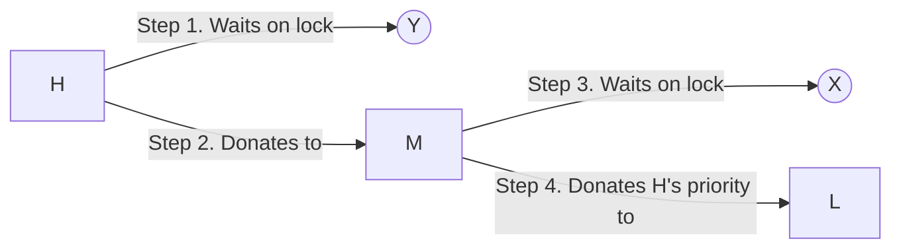

# 操作系统 Project2

> 参考链接：[1](https://max.book118.com/html/2017/0525/109109611.shtm) [2](https://blog.csdn.net/Woochy_Young/article/details/89908059#Task3%EF%BC%9AAdvanced%20Scheduler) [3](https://github.com/raririn/pintos.git) [4](https://github.com/tfdavids-zz/pintos.git) [5](https://jackyanghc.github.io/2019/05/07/standford-操作系统实验-pintos-Project-1-threads/) 


## Part 1: ALARM CLOCK

### 1. DATA STRUCTURES

> A1: Copy here the declaration of each new or changed `struct` or `struct` member, global or static variable, `typedef`, or enumeration.  Identify the purpose of each in 25 words or less.

```c
struct thread {
+   int64_t block_ticks;
};

/* 添加变量的目的：
 * 	- 记录线程被block的时间还剩多少个ticks
 * 	- 每次发生计时器中断时自减
 * 	- 减至零时将线程unblock
 */
```


### 2. ALGORITHMS

>A2: Briefly describe what happens in a call to timer_sleep(), including the effects of the timer interrupt handler.

>A3: What steps are taken to minimize the amount of time spent in the timer interrupt handler?

```sh
1. 在 timer_sleep(ticks) 中：
	(1) 设置当前线程的 block_ticks 为参数 TICKS
	(2) 将当前线程 block
2. 在 timer_interrupt() 中：
	(1) 全局变量 ticks 自增
	(2) 所有被 block 的线程的 block_ticks 自减
		- 如果线程的 block_ticks 减至零，将其 unblock
	(3) 调用 thread_tick()：
		- 更新 idle_ticks、user_ticks、kernel_ticks，分别表示 idle 线程，用户线程，kernel线程用的时间；
		- 如果当前线程的时间片用尽了，强制切换线程
3. 在线程结构中加入 block_ticks 变量记录仍需要被 block 的时间，每次发生计时器中断时，这些变量自减；在线程数较少的情况下，可以省去了额外维护 BLOCK 状态线程的链表的开销
```


### 3. SYNCHRONIZATION

>A4: How are race conditions avoided when multiple threads call timer_sleep() simultaneously?

>A5: How are race conditions avoided when a timer interrupt occurs during a call to timer_sleep()?

```sh
两个关键的函数调用：
	enum intr_level old_level = intr_disable();
	...
	intr_set_level (old_level);

这两个函数间构成临界区，在中间处理时，禁止发生中断
```


### 4. RATIONALE

>A6: Why did you choose this design?  In what ways is it superior to another design you considered?

```sh
1. 想到的其他处理方式：
	(1) 在线程中，同样增加 block_ticks 变量，意义相同
	(2) 类似于ready_list，同样维护一个全局的 BLOCK 的线程的链表，可以按照剩余 block 时间升序排序，也可以不排序
2. 与现有处理方式的区别：
	(1) 现有处理方式：当发生计时器中断时，因为不确定哪些线程正处于 BLOCK 状态，所以需要将所有线程遍历
	(2) 其他处理方式：当发生计时器中断时，可以只遍历 BLOCK 的线程
3. 两种处理方式对比：
	(1) 现有处理方式比较直接，实现上更加简单
	(2) 维护 BLOCK 线程的链表需要额外的一些开销，尤其如果要对链表排序的话，但是当发生中断时，可以精准遍历
4. 选取当前处理方式的原因：实现简单
```


## Part 2: PRIORITY SCHEDULING

### 1. DATA STRUCTURES

>B1: Copy here the declaration of each new or changed `struct` or `struct` member, global or static variable, `typedef`, or enumeration.  Identify the purpose of each in 25 words or less.

```c
struct thread {
+   int base_priority;
+   struct list locks;
+   struct lock *lock_waiting;
};

/* 添加变量的目的：
 *	(1) base_priority： 记录线程的基础优先级，即去掉优先级捐赠后，线程的优先级
 *	(2) locks：记录线程当前持有的锁，用于优先级捐赠的处理：线程的优先级时刻等于持有锁的最高优先级
 *	(3) lock_waiting：指当前线程正在等待的锁，同样用于优先级捐赠的处理：锁的优先级时刻等于等待线程的最高优先级
 */
```


```c
struct lock {
+	struct list_elem elem;
+	int max_priority;
};

/* 添加变量的目的：
 *	(1) elem：线程中持有锁的列表 locks 是 list_elem 结构维护的
 *	(2) max_priority：锁被捐赠的最高优先级，用于更新当前持有锁的线程的优先级
 */
```


>B2: Explain the data structure used to track priority donation.Use ASCII art to diagram a nested donation.  (Alternately, submit a .png file.)

```sh
1. thread->locks：
	(1) 按照锁的优先级降序维护当前线程持有的所有锁的链表，因为是链表，所以需要在lock结构中增加elem成员；
	(2) 当发生优先级捐赠或者撤销优先级捐赠时，通过该列表可以时刻找到当前持有的锁的最高优先级
2. thread->lock_waiting：
	(1) 只当前线程正在等待的锁
	(2) 当线程的优先级改变时，会根据该项捐赠所有正在等待的锁的优先级，进一步才能捐赠这些锁的持有者的优先级
3. lock->max_priority：
	(1) 锁的最高优先级
	(2) 因为同一个锁可能有多个线程在等待，需要选取等待线程和持有线程的最高优先级作为锁的优先级，保存该值是用于，当由锁的优先级改变造成线程有限变化时，线程优先级将会改为该值
```


```sh
考虑嵌套情况如下：
(1) 线程：H M 和 L，优先级从高到低
(2) 锁：X 和 Y
(3) L持有X；M持有Y
(4) H等待Y；M等待X
```





### 2. ALGORITHMS

>B3: How do you ensure that the highest priority thread waiting for a lock, semaphore, or condition variable wakes up first?

>B4: Describe the sequence of events when a call to lock_acquire() causes a priority donation.  How is nested donation handled?

>B5: Describe the sequence of events when lock_release() is called on a lock that a higher-priority thread is waiting for.

```sh
1. 在锁上等待：ready_list 按照优先级降序排列；
在条件变量上等待：condition->waiters 按照优先级降序排列
在信号量上等到：semaphore->waiters 按照优先级降序排列
2. 	(1) lock_acquire()：
	- 在成功获取到锁前：
		a. 禁用中断
		b. 根据当前线程的优先级，更新锁的最大优先级
		c. 更新锁的持有者的优先级
		d. 更新锁的持有者线程正在等待的锁的优先级
		e. 重复bc直至不需要继续捐赠：锁的优先级 ≥ 当前线程的优先级
		f. 启用中断
	- 成功获取到锁之后：
		a. 禁用中断
		b. 如果锁的优先级高于当前线程的优先级，那么更新当前线程的优先级
		c. 更新线程等待的其余锁的持有者的优先级
		d. 更新其余锁的持有者线程正在等待的锁的优先级
		e. 重复bc直至不需要继续捐赠：锁的优先级 ≥ 当前线程的优先级
		f. 启用中断
	(2) 处理嵌套锁：高优先级H的线程因为锁被低优先级L的线程持有而阻塞，那么提高锁的优先级，之后提高锁的持有者线程即L的优先级等于高优先级，避免被高优先级线程H抢占
3. lock_release()：
	a. 将锁从当前线程的持有锁列表中移除，并按照剩余持有锁更新当前线程的优先级，如果线程不持有任何锁，那么将优先级改为 thread->base_priority
	b. 根据 lock->elem 更新锁的优先级
```


### 3. SYNCHRONIZATION

>B6: Describe a potential race in thread_set_priority() and explain how your implementation avoids it.  Can you use a lock to avoid this race?

```sh
1. 如果一个线程设置其优先级，而另一个线程尝试将其优先级捐赠给该线程，则存在竞争。所得的有效优先级可能成为捐赠线程中当前优先级最高的线程和当前线程的优先级中的最大值
2. 通过禁用中断避免这种竞争
3. 不可以通过锁解决这个问题：
	(1) 线程A和B，A正在执行thread_set_priority()，B尝试将优先级捐赠给线程A
	(2) 根据优先级捐赠，B会将优先级捐赠给A
	(3) 但是B只有等待A放弃锁才能改变A的优先级
	(4) 可能会造成死锁
```


### 4. RATIONALE

>B7: Why did you choose this design?  In what ways is it superior to another design you considered?

```sh
1. 针对ready_list的实现考虑的其他处理方式：
	(1) ready_list 并不根据优先级大小插入，而是在每次调度前进行排序
	(2) 创建一个长度为64的数组，每一项都是一个指向链表的指针，链表中存的是对应优先级的线程，按照先后顺序排列
	(3) 将(2)中的数组更换为最长长度为64链表，其余相同
2. 相比之下，按照当前方式处理的效率较高，而且对于链表的处理更加简单
	- (1) 处理方式相较当前处理方式要复杂很多，对链表排序，需要不断改变指针
	- (2) 处理方式占用内存多，线程的优先级并不是均匀分布的，大部分优先级都没有对应的线程，因此数组中很多指针都是指向空链表
	- (3) 处理方式相较 (2) 节约内存，但是考虑到链表的维护，在实现上更加复杂
	- 相较(3)，当前的处理方式在遍历插入链表时需要额外的时间开销，但是实现更为简单
```


## Part 3: ADVANCED SCHEDULER

### 1. DATA STRUCTURES

>C1: Copy here the declaration of each new or changed `struct` or `struct` member, global or static variable, `typedef`, or enumeration.  Identify the purpose of each in 25 words or less.

```c
struct thread {
+   int nice;
+   fixed_t recent_cpu;
  };

/* 添加变量的目的：
 *	(1) nice：线程的nice值
 *	(2) recent_cpu：线程至今使用的CPU时间
 * 二者都是更新线程优先级时用到
 */
```


```c
fixed_t load_avg;

/* thread.c 中的全局变量，添加变量的目的：
 * 	记录当前CPU的负载，更新线程优先级用到
 */
```


### 2. ALGORITHMS

>C2: Suppose threads A, B, and C have nice values 0, 1, and 2.  Each has a recent_cpu value of 0.  Fill in the table below showing the scheduling decision and the priority and recent_cpu values for each thread after each given number of timer ticks:

| timer ticks | R(A) | R(B) | R(C) | P(A) | P(B) | P(C) | thread to run |
| :---------: | :--: | :--: | :--: | :--: | :--: | :--: | :-----------: |
|      0      |  0   |  0   |  0   |  63  |  61  |  59  |       A       |
|      4      |  4   |  0   |  0   |  62  |  61  |  59  |       A       |
|      8      |  8   |  0   |  0   |  61  |  61  |  59  |       B       |
|     14      |  8   |  4   |  0   |  61  |  60  |  59  |       A       |
|     16      |  12  |  4   |  0   |  60  |  60  |  59  |       B       |
|     20      |  12  |  8   |  0   |  60  |  59  |  59  |       A       |
|     24      |  16  |  8   |  0   |  59  |  59  |  59  |       C       |
|     28      |  16  |  8   |  4   |  59  |  59  |  58  |       B       |
|     32      |  16  |  12  |  4   |  59  |  58  |  58  |       A       |
|     36      |  20  |  12  |  4   |  58  |  58  |  58  |       C       |


>C3: Did any ambiguities in the scheduler specification make values in the table uncertain?  If so, what rule did you use to resolve them?  Does this match the behavior of your scheduler?

```sh
1. 当两个线程的priority相同时，如何调度的问题
2. 我的处理方案是：
	(1) 当前线程先执行
	(2) 最近最少运行的线程限制性
3. 与调试程序的行为一致
```


>C4: How is the way you divided the cost of scheduling between code inside and outside interrupt context likely to affect performance?

```sh
1. 在我的实现中，仅当nice值被改变的时候，计算才会在中断之外完成；中断内部，每4个ticks更新所有线程的优先级，每秒更新load_avg和recent_cpu
2. 每4个ticks更新所有线程的优先级，每秒钟都在所有线程上计算load_avg、recent_cpu以及优先级，当系统中存在很多线程时，这样做的代价很高
```


### 3. RATIONALE

>C5: Briefly critique your design, pointing out advantages and disadvantages in your design choices.  If you were to have extra time to work on this part of the project, how might you choose to refine or improve your design?

```sh
1. 优势：
	(1) 层次明确，新增的变量和函数都在对应的.h和.c文件中，可读性好，也便于调试
	(2) 在源代码的基础上改动很少，在性能和实现的复杂性上做了权衡，在保持性能尽量高的情况下，选择易实现的方式
2. 劣势：
	(1) 临界区的实现都是通过中断的禁用与启动完成的
	(2) ready_list始终维护的是一个降序的链表，每次插入的时间复杂度为O(n)
3. 改进：
	(1) 尝试使用其他的方式，比如信号量等来确保临界区
	(2) 可以尝试使用优先级的极大堆，需要来维护ready_list，将其插入的复杂度降低到O(n·logn)
```


>C6: The assignment explains arithmetic for fixed-point math in detail, but it leaves it open to you to implement it.  Why did you decide to implement it the way you did?  If you created an abstraction layer for fixed-point math, that is, an abstract data type and/or a set of functions or macros to manipulate fixed-point numbers, why did you do so?  If not, why not?

```sh
1. 浮点数计算在头文件中使用宏定义
2. 原因如下：
	(1) 计算简单，使用宏定义并不复杂
	(2) 使用宏定义的方式，代码的可读性更高，也更易于理解
	(3) 因为计算很简单，使用宏的方式在预处理时被替换，可以省去函数调用、返回、释放的问题
	(4) 计算的情况很单一，很难出现参数类型不匹配的情况
```


## Part 4：执行结果


